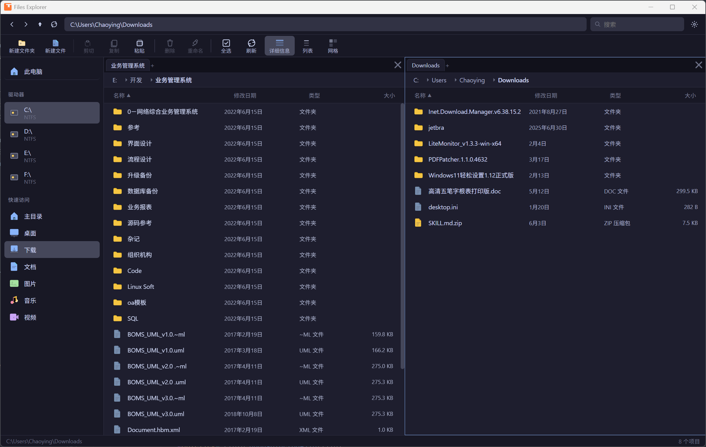
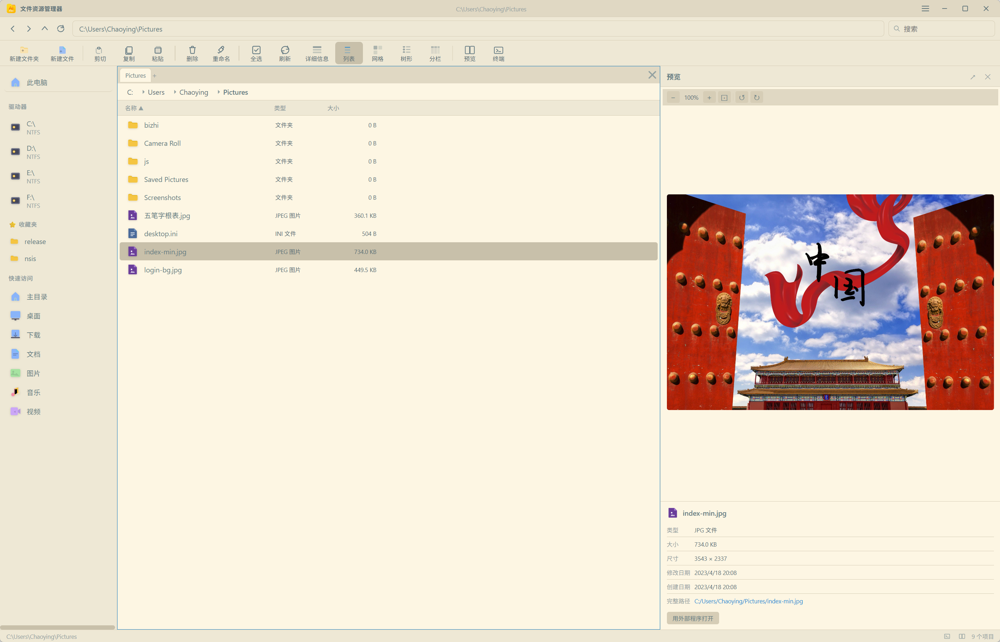

<div align="center">
  
  <h1>Files Explorer</h1>
  <p>基于 <strong>Tauri 2.0</strong> 和 <strong>Vue 3</strong> 构建的现代化跨平台桌面文件资源管理器</p>
  <p>
    
    
    
    
    
    
  </p>
</div>

---

## 📖 概述

**Files Explorer** 是一款跨平台桌面文件管理器，将 **Rust** 后端的高性能文件操作能力与 **Vue 3** 丰富的交互界面相结合。采用 **模块化架构**（前端 6 Pinia Stores + 后端 11 Rust 模块），支持多标签页、分屏面板、完整文件操作、高级搜索、压缩解压、收藏夹以及中英文国际化。

### 🖥️ 平台支持

| 平台 | 状态 | 原生架构 |
|------|------|---------|
| **Windows** | ✅ 完全支持 | x86_64 |
| **macOS** | ✅ 完全支持 | Universal (x86_64 + ARM64) |
| **Linux** | ✅ 完全支持 | x86_64 |

---

## ✨ 功能特性

### 📂 文件浏览与导航
- **五种视图模式** — 详细信息、列表、网格、树形（递归展开）、分栏（Miller Columns）
- **虚拟滚动** — 大目录（10,000+ 文件）仅渲染可见行，保持 60fps
- **流式目录加载** — 100 条/批流式渲染，大目录无卡顿
- **地址栏自动补全** — 输入路径时实时查询子目录并下拉匹配
- **面包屑导航** — 每个面板独立显示，点击路径段跳转
- **历史导航** — 后退 / 前进 / 向上，50 条历史记录
- **文件属性面板** — 右侧栏：文件类型、大小、修改/创建时间、图片分辨率、多选总计（`Ctrl+P`）

### 🖥️ 多面板与标签页
- **多标签页** — 每个面板可打开多个标签页，`Ctrl+W` 关闭
- **分屏面板** — 水平或垂直拆分面板（最多 4 个方向），各自独立浏览
- **标签悬停切换** — 拖拽文件悬停标签 500ms 自动切换
- **独立状态** — 每个标签页记忆自己的路径、文件列表、树展开和选中状态

### 📋 文件操作
| 操作 | 说明 | 平台适配 |
|------|------|---------|
| **新建文件夹 / 文件** | 创建空文件或文件夹 | 全平台 |
| **重命名** | 内联重命名，`F2` | 全平台 |
| **复制 / 剪切 / 粘贴** | 内部剪贴板 + 系统剪贴板双向互通 | Win32 CF_HDROP / macOS NSPasteboard |
| **删除** | 移入回收站 / 永久删除，带确认对话框 | `trash` crate |
| **打开文件** | 系统默认程序打开 | `opener` crate |
| **压缩 / 解压** | 选中文件 → 右键「压缩到...」；右键归档文件「解压到...」 | `zip` + `tar` + `flate2` |
| **文件属性** | 内联属性面板 + 系统属性对话框 | Win32 SHObjectProperties / macOS Finder |
| **在 Finder/资源管理器 中显示** | 定位到文件所在位置 | `explorer /select` / `open -R` / `xdg-open` |
| **在终端中打开** | 在当前目录启动终端 | Windows Terminal / Terminal.app / 自动检测 |
| **拖放** | 内部拖拽移动 + 原生拖出到其他应用 | COM DoDragDrop (Win) / text/uri-list |

### 🔍 高级搜索
- 使用 `walkdir` 递归搜索，独立 OS 线程 + `AtomicBool` 取消
- 自动跳过无关目录（`node_modules`、`.git`、`target`、`__pycache__` 等 17 个）
- **文件名搜索** — 三种匹配模式（支持 `|` 分隔的 OR 组合）：
  | 模式 | 示例 | 说明 |
  |------|------|------|
  | 子串匹配 | `readme` | 大小写不敏感 |
  | 通配符 | `*.rs`, `test?.*` | `*` 任意字符, `?` 单个字符 |
  | 大小过滤 | `>10MB`, `<1GB` | 支持 B/KB/MB/GB/TB |
- **内容搜索** — 点击 🔍 切换按钮，直接在文件内容中搜索文本
- 分批流式返回结果（500 条/批），上限 2000 条
- 搜索结果独立标签页展示

### ⭐ 收藏夹
- 右键文件夹 →「添加到收藏夹」
- 侧边栏 ⭐ Favorites 区域展示所有收藏
- 右键书签 → 确认移除
- 持久化到 `localStorage`

### ⏪ 撤销系统
- 自动记录操作历史（最多 50 条）
- `Ctrl+Z` 撤销支持：重命名、新建文件/文件夹、复制粘贴、剪切粘贴
- 删除操作出于安全考虑 **不可撤销**

### ⌨️ 快捷键

| 快捷键 | 功能 |
|--------|------|
| `Enter` | 打开选中文件 / 进入目录 |
| `Backspace` | 返回上级目录 |
| `Space` | 预览 / 打开选中文件 |
| `Ctrl+N` | 新建文件 |
| `Ctrl+Shift+N` | 新建文件夹 |
| `Ctrl+C` / `Ctrl+X` / `Ctrl+V` | 复制 / 剪切 / 粘贴 |
| `Ctrl+A` | 全选 |
| `Delete` / `Shift+Delete` | 回收站 / 永久删除（带确认） |
| `F2` | 重命名 |
| `F5` | 刷新 |
| `Ctrl+P` | 切换属性面板 |
| `Ctrl+W` | 关闭当前标签页 |
| `Ctrl+Tab` / `Ctrl+Shift+Tab` | 切换标签页 |
| `Ctrl+Z` | 撤销上次操作 |
| `Ctrl+[` / `Ctrl+]` | 后退 / 前进 |
| `Cmd+↑` / `Cmd+↓` | 上级目录 / 打开选中项 |
| `Esc` | 取消剪切状态 |
| `Ctrl+,` | 打开设置 |

### 🎨 视觉设计
- **现代化风格** — Fluent Design 文件类型图标（Word/Excel/PPT/PDF/代码/图片/视频/音频/压缩包等 50+ 类型）
- **深色 / 浅色主题** — Catppuccin Mocha（深色）和 Catppuccin Latte（浅色）配色方案
- **三种字体大小** — 小 / 中 / 大
- **文件类型颜色编码** — 9 种颜色分类，深色/浅色主题自动适配
- **自定义标题栏** — 自绘窗口控件（最小化/最大化/关闭）

### 🌐 国际化
- **简体中文** 和 **English** 双语支持
- 覆盖所有 UI 文本、右键菜单、对话框、文件类型标签
- 切换即时生效，无需重启

---

## 🏗️ 架构设计

### 整体分层

```
┌────────────────────────────────────────────────────┐
│                 Vue 3 前端层 (src/)                  │
│  ┌──────────┐  ┌──────────────┐  ┌──────────────┐  │
│  │ 18 组件   │  │ 7 Composables │  │ 6 Pinia Stores│ │
│  └──────────┘  └──────────────┘  └──────────────┘  │
├────────────────────────────────────────────────────┤
│                Tauri IPC Bridge                     │
│        invoke() / listen() / emit()                 │
├────────────────────────────────────────────────────┤
│                Rust 后端层 (src-tauri/)              │
│  ┌──────────────────────────────────────────────┐  │
│  │  11 模块 / 27 个命令 / 39 集成测试             │  │
│  │  types / files / drives / operations          │  │
│  │  clipboard / search / compress / system / undo │  │
│  └──────────────────────────────────────────────┘  │
└────────────────────────────────────────────────────┘
```

### 六仓库模式（Six-Stores Pattern）

| 仓库 | 职责 | 关键状态 |
|------|------|---------|
| **`fileStore`** | 文件浏览核心 | `currentPath`、`files`、`drives`、`loading`、`error`、`isSearching` |
| **`tabStore`** | 分屏布局与标签页 | 递归 `LayoutNode` 树（Pane/Split）、标签增删切换、拖放 |
| **`selectionStore`** | 文件选择与剪贴板 | `selectedFiles`、`cutFiles`、`isCutPending`、copy/cut/paste |
| **`viewStore`** | 视图模式与树形 | `viewMode`、`treeExpanded`、`treeChildrenCache`、分栏操作 |
| **`navigationStore`** | 导航历史 | `history`(50条)、`historyIndex`、back/forward/up/home |
| **`settingsStore`** | 用户偏好与书签 | `theme`、`locale`、`fontSize`、`bookmarks` |

### Composables 事件编排层 (7 个)

| Composable | 职责 |
|-----------|------|
| `useFileActions` | 文件操作调度（open/cut/copy/paste/delete/rename/new/refresh/compress/extract/properties/showInExplorer/bookmark） |
| `usePanelNavigation` | 面板/标签页导航（切换/新建/关闭/分割/侧栏跳转） |
| `useKeyboardShortcuts` | 全局快捷键注册与分发（20+ 快捷键） |
| `useSearchService` | 搜索生命周期管理（创建搜索标签、监听 progress 事件、内容搜索） |
| `useDragDrop` | 内部文件拖放移动 + 标签拖放导入 |
| `useContextMenu` | 右键菜单动态生成（根据选中状态/文件类型/路径上下文） |
| `useToast` | 全局 Toast 消息队列（多消息堆叠） |

### 数据流

```
用户操作（点击、按键、拖拽）
        │
        ▼
  Vue 组件 ──emit──► App.vue（Composables 编排）
        │                        │
        │              ┌─────────┴──────────┐
        │              ▼                    ▼
        │        tabStore              fileStore
        │      navigationStore         selectionStore
        │       viewStore              deleteStore
        │              │                    │
        │              └─────────┬──────────┘
        │                        ▼
        ▼                  Tauri IPC invoke()
  FileList 读取         ───────────────────►
  活动标签页数据             Rust 后端命令
                                    │
                          ┌─────────┴──────────┐
                          ▼                    ▼
                     文件系统操作         AppState 管理
                  (walkdir/trash/zip)  (剪贴板/撤销/搜索取消)
```

### Rust 后端命令（共 27 个）

| 分类 | 命令 | 说明 |
|------|------|------|
| **目录浏览** | `list_directory` | 列出目录内容并排序（目录优先） |
| | `list_directory_streamed` | 流式目录加载，100条/批发射事件 |
| | `get_drives` | 获取磁盘驱动器信息（Win32 API / Unix statvfs） |
| **导航** | `get_parent_directory` | 获取父目录路径 |
| | `path_exists` | 检查路径是否存在 |
| | `get_special_dirs` | 获取用户特殊目录（桌面/文档/下载等） |
| **文件操作** | `create_directory` | 递归创建目录 + 撤销记录 |
| | `create_file` | 创建空文件 + 撤销记录 |
| | `delete_item` | 移入回收站 / 永久删除 |
| | `rename_item` | 重命名 + 撤销记录 |
| | `move_files` | 移动/复制文件（同设备 rename / 跨设备 copy+delete） |
| | `compress_files` | 压缩选中文件/文件夹为 zip |
| | `extract_archive_cmd` | 解压 zip/tar/tar.gz 归档 |
| **剪贴板** | `copy_clipboard` | 复制：内部剪贴板 + 系统剪贴板 |
| | `cut_clipboard` | 剪切：内部剪贴板 + 系统剪贴板 |
| | `paste_clipboard` | 粘贴（优先系统 → 回退内部），名冲突自动解决 |
| | `get_clipboard_info` | 查询剪贴板状态 |
| **文件打开** | `open_file` | 系统默认程序打开 |
| | `show_in_explorer` | 在文件管理器中定位 |
| | `show_file_properties` | 显示系统属性面板 |
| | `open_in_terminal` | 在当前目录打开终端 |
| | `get_file_base64` | 读取文件为 base64（图片预览，≤2MB） |
| **搜索** | `search_files` | 递归搜索（子串/通配符/大小过滤/内容搜索，自动跳过无关目录） |
| | `cancel_search` | 通过 AtomicBool 取消搜索线程 |
| **拖放** | `start_native_drag_cmd` | 原生拖出到其他应用（Windows COM DoDragDrop） |
| **撤销** | `undo_last_action` | 撤销最近操作（重命名/新建/复制/剪切） |
| | `get_undo_info` | 查询撤销栈顶信息 |

### Rust 模块拆分

```
src-tauri/src/
├── main.rs          # 入口 + 日志轮转（保留最近 5 个日志文件）
├── lib.rs           # 模块声明 + #[command] 薄包装 + run()
├── types.rs         # 数据结构（FileEntry, DiskInfo, FsError, 常量...）
├── state.rs         # AppState（剪贴板、撤销历史、搜索取消标志）
├── files.rs         # 目录列表 / 文件信息
├── drives.rs        # 磁盘枚举 / 特殊目录
├── operations.rs    # 文件增删改移 + 粘贴冲突解决
├── clipboard.rs     # 剪贴板（macOS NSPasteboard / Windows CF_HDROP）
├── search.rs        # 搜索（通配符/大小过滤/内容匹配，跳过无关目录）
├── compress.rs      # 压缩/解压（zip/tar/tar.gz，进度事件推送）
├── system.rs        # 系统命令（打开/终端/预览/属性/拖拽）
├── undo.rs          # 撤销系统
└── native_drag.rs   # Windows COM 原生拖拽
```

---

## 📁 项目结构

```
files-explorer/
├── src/                              # 前端 (Vue 3 + TypeScript)
│   ├── components/                   # Vue 组件 (18个)
│   │   ├── Breadcrumb.vue            # 面包屑导航
│   │   ├── ColumnContainer.vue       # 分栏视图容器
│   │   ├── ColumnPane.vue            # 分栏视图单列
│   │   ├── ContextMenu.vue           # 右键上下文菜单
│   │   ├── DetailsListView.vue       # 详细信息视图（虚拟滚动）
│   │   ├── FileItem.vue              # 文件/文件夹项
│   │   ├── FileList.vue              # 文件列表容器（排序/列宽/拖放）
│   │   ├── GridView.vue              # 网格视图
│   │   ├── PaneNode.vue              # 递归分屏面板容器
│   │   ├── PropertiesPanel.vue       # 文件属性侧边栏
│   │   ├── RibbonToolbar.vue         # Ribbon 风格操作栏
│   │   ├── Sidebar.vue               # 侧栏（驱动器/收藏夹/快速访问）
│   │   ├── StatusBar.vue             # 底栏状态栏
│   │   ├── ThisPcView.vue            # "此电脑" 驱动器卡片视图
│   │   ├── TitleBar.vue              # 自定义窗口标题栏
│   │   ├── Toolbar.vue               # 工具栏（导航/地址栏自动补全/搜索）
│   │   ├── TreeView.vue              # 树形视图（递归展开）
│   │   └── Dialogs/                  # 模态对话框
│   │       ├── DeleteConfirmDialog.vue
│   │       ├── NewItemDialog.vue
│   │       ├── RenameDialog.vue
│   │       └── SettingsDialog.vue
│   ├── composables/                  # 组合式函数 (7个)
│   │   ├── useContextMenu.ts         # 右键菜单逻辑
│   │   ├── useDragDrop.ts            # 内部拖放
│   │   ├── useFileActions.ts         # 文件操作调度
│   │   ├── useKeyboardShortcuts.ts   # 全局快捷键（20+）
│   │   ├── usePanelNavigation.ts     # 面板/标签导航
│   │   ├── useSearchService.ts       # 搜索服务
│   │   └── useToast.ts              # Toast 消息队列
│   ├── stores/                       # Pinia 状态仓库 (6个)
│   │   ├── fileStore.ts              # 文件浏览核心
│   │   ├── tabStore.ts               # 分屏布局树/标签页
│   │   ├── selectionStore.ts         # 选择/剪贴板
│   │   ├── viewStore.ts              # 视图模式/树形/分栏
│   │   ├── navigationStore.ts        # 导航历史
│   │   └── settingsStore.ts          # 主题/语言/字体/收藏夹
│   ├── locales/                      # 国际化
│   │   ├── en.ts                     # English
│   │   └── zh.ts                     # 简体中文
│   ├── types/
│   │   └── index.ts                  # TypeScript 类型定义
│   ├── utils/
│   │   ├── fileIcons.ts              # Fluent 文件图标（50+ 类型 + 缓存）
│   │   ├── fileTypes.ts              # 文件类型颜色编码
│   │   └── tauri.ts                  # Tauri IPC 封装（24+ 函数）
│   ├── App.vue                       # 根组件（事件编排中心 + 全局错误边界）
│   ├── i18n.ts                       # vue-i18n 配置
│   ├── main.ts                       # 应用入口
│   └── style.css                     # 全局样式 + Catppuccin 主题变量
│
├── src-tauri/                        # 后端 (Rust)
│   ├── src/                          # 11 个模块
│   │   ├── main.rs                   # 入口 + 日志轮转
│   │   └── lib.rs                    # 命令注册 + 入口
│   ├── capabilities/
│   │   └── default.json              # 权限配置
│   ├── icons/                        # 应用图标
│   ├── tests/                        # Rust 集成测试 (39个)
│   │   └── functional_tests.rs
│   ├── Cargo.toml                    # Rust 依赖
│   ├── build.rs                      # Tauri 构建脚本
│   └── tauri.conf.json               # Tauri 配置
│
├── screenshots/                      # 截图
├── index.html                        # HTML 入口
├── vite.config.ts                    # Vite 配置
├── tsconfig.json                     # TypeScript 配置
└── package.json                      # Node.js 依赖
```

---

## 🚀 快速开始

### 环境要求

- [Node.js](https://nodejs.org) ≥ 18
- [Rust](https://rustup.rs) ≥ 1.77
- [Tauri 2.0 系统依赖](https://v2.tauri.app/start/prerequisites/)

**macOS 额外依赖：**
```bash
xcode-select --install  # Xcode Command Line Tools
```

**Linux 额外依赖：**
```bash
sudo apt install libwebkit2gtk-4.1-dev libgtk-3-dev libayatana-appindicator3-dev  # Debian/Ubuntu
```

### 开发模式

```bash
npm install         # 安装前端依赖
npm run tauri dev   # 启动开发模式（热重载）
```

### 测试

```bash
# Rust 后端测试（39 个集成测试）
cd src-tauri && cargo test

# 前端类型检查
npx vue-tsc --noEmit
```

### 构建

```bash
# 标准构建
npm run tauri build

# macOS 通用二进制（Intel + Apple Silicon）
npm run tauri build -- --target universal-apple-darwin

# 构建 DMG 安装镜像
npm run tauri build -- --bundles dmg
```

### 构建产物位置

```
src-tauri/target/release/bundle/dmg/Files Explorer_0.1.4_x64.dmg   # macOS DMG
src-tauri/target/release/bundle/macos/Files Explorer.app           # macOS .app
src-tauri/target/release/files-explorer.exe                        # Windows
```

### 首次运行（macOS 未签名）

```bash
xattr -cr "Files Explorer.app"
open "Files Explorer.app"
```

---

## 🧩 技术栈

| 层级 | 技术 | 说明 |
|------|------|------|
| **桌面框架** | [Tauri 2.0](https://v2.tauri.app) | Rust 后端 + WebView 前端 |
| **前端框架** | [Vue 3.4](https://vuejs.org) | Composition API + `<script setup>` |
| **状态管理** | [Pinia 2](https://pinia.vuejs.org) | 六仓库模式 |
| **虚拟滚动** | [@tanstack/vue-virtual](https://tanstack.com/virtual) | 大列表高性能渲染 |
| **国际化** | [vue-i18n 9](https://vue-i18n.intlify.dev) | 中英双语 |
| **构建工具** | [Vite 5](https://vitejs.dev) | 前端构建 + HMR |
| **后端语言** | [Rust](https://www.rust-lang.org) | 内存安全 + 零成本抽象 |

### 关键 Rust 依赖

| Crate | 版本 | 用途 |
|-------|------|------|
| `tauri` | 2.x | 桌面框架核心 |
| `walkdir` | 2 | 递归目录遍历（搜索） |
| `serde` / `serde_json` | 1 | JSON 序列化 |
| `zip` | 2 | ZIP 压缩/解压 |
| `tar` | 0.4 | TAR 归档处理 |
| `flate2` | 1 | Gzip 压缩/解压 |
| `trash` | 3 | 跨平台回收站操作 |
| `opener` | 0.7 | 跨平台文件打开 |
| `arboard` | 3 | 系统剪贴板 |
| `dirs` | 6 | 用户目录路径 |
| `base64` | 0.22 | Base64 编码（图片预览） |
| `log` / `simplelog` | 0.4 / 0.12 | 应用日志 + 轮转 |

---

## 🖼️ 截图

| 深色主题 | 浅色主题 |
|----------|----------|
|  |  |

---

## 📄 许可证

本项目基于 MIT 许可证开源。详见 [LICENSE](LICENSE) 文件。

---

<div align="center">
  使用 ❤️ 和 Tauri + Vue + Rust 构建
</div>
