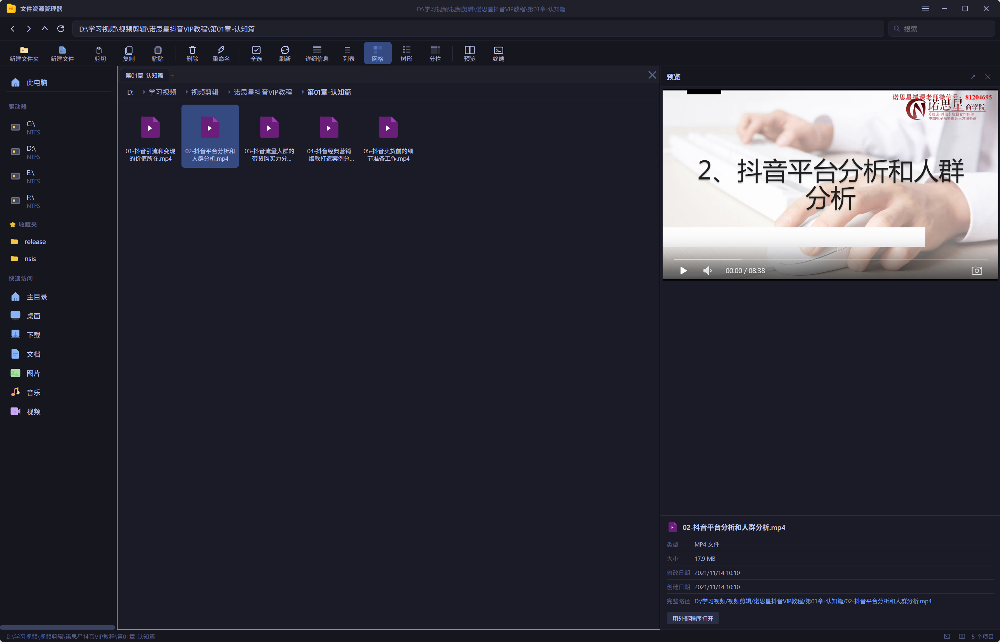
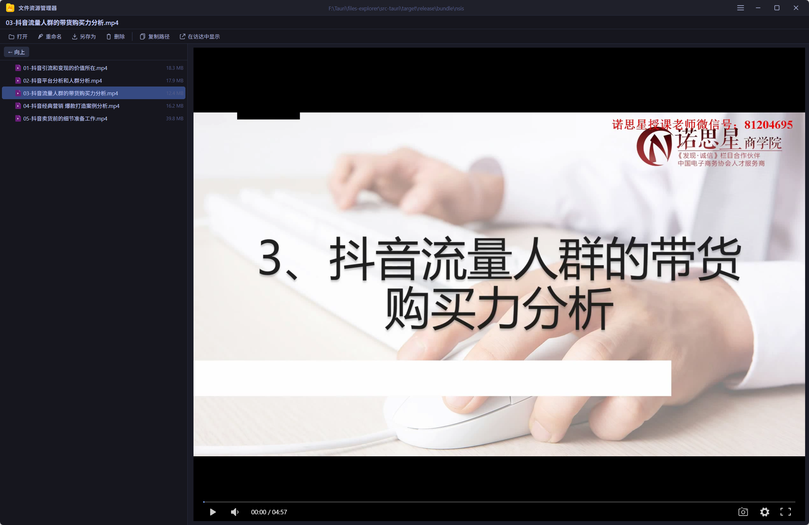

<div align="center">
  
  <h1>Files Explorer</h1>
  <p>
    <strong>Lightweight · Fast · Modern · Smart</strong><br/>
    A cross-platform desktop file manager built with <strong>Tauri 2.0</strong> + <strong>Vue 3</strong>
  </p>
  <p>
    
    
    
    
    
    
  </p>
</div>

---

## 💡 Design Philosophy

- **⚡ Lightweight** — Tauri 2.0 native binary, memory usage as low as **1/10** of Electron-based alternatives
- **🚀 Blazing Fast** — Rust-powered zero-overhead file operations + virtual scrolling + streaming loads, 60fps with tens of thousands of files
- **🎨 Modern** — 7 themes × 3 icon styles, frameless window, native Tauri Splashscreen
- **🧠 Smart** — Built-in terminal (PTY), 50+ language syntax highlighting, Office/PDF/Video/Archive previews, wildcard search, system tray

> 📖 **Full user manual**: [docs/user-manual-en.md](docs/user-manual-en.md)

<div align="center">
  
  <br/>
  <em>Dark theme (Catppuccin Mocha)</em>
  <br/><br/>
  
  <br/>
  <em>Light theme (Catppuccin Latte)</em>
  <br/><br/>
  
  <br/>
  <em>File and video preview panel</em>
  <br/><br/>
  
  <br/>
  <em>Standalone preview window</em>
</div>

---

## 🖥️ Platform Support

| Platform | Status | Architecture |
|----------|--------|-------------|
| **Windows** | ✅ | x86_64 |
| **macOS** | ✅ | x86_64 + ARM64 |
| **Linux** | ✅ | x86_64 |

---

## ✨ Key Features

### 📂 File Browsing

| Feature | Description |
|---------|-------------|
| **5 Views** | Details / List / Grid / Tree / Miller Columns |
| **Virtual Scrolling** | @tanstack/vue-virtual — renders only visible rows even with thousands of files |
| **Streaming Load** | 100 items per batch push, instant response for large directories |
| **Address Bar Autocomplete** | Real-time subdirectory matching with dropdown navigation |
| **Breadcrumb Navigation** | Windows drive letters / Unix path segment navigation |
| **Navigation History** | Back / Forward / Up, 50 history snapshots |

### 🖥️ Multi-Pane Workflow

| Feature | Description |
|---------|-------------|
| **Tabs** | IDE-like tab experience, Ctrl+W to close, drag to reorder |
| **Split Panes** | Horizontal/vertical split, draggable divider |
| **Isolated State** | Each tab independently remembers path, list/tree view, and search state |
| **Drag & Drop** | Drag files into directories, tab switching, Windows COM external drag-out |

### 🔍 Smart Preview

| Preview Type | Capability |
|-------------|-----------|
| **Code Highlighting** | 50+ languages via CodeMirror 5, line numbers, selection, theme-adaptive |
| **Markdown** | Edit/preview, Shiki highlighting, DOMPurify XSS protection, export to HTML/Word/PDF |
| **Office Documents** | Inline rendering of docx / xlsx / pptx |
| **PDF** | Zoom, pan with drag |
| **Video** | DPlayer — supports MP4/WebM/FLV, screenshots, hotkeys, playback speed |
| **Images** | Zoom, rotate, pan, auto-read dimensions |
| **Archives** | Browse ZIP/7z/RAR/TAR contents, single-entry extract and preview |
| **Encoding Detection** | Auto-detect UTF-8/GBK/Shift-JIS/Latin-1/UTF-16, correct display for non-UTF-8 files |
| **Standalone Preview Window** | 65%×75% adaptive size, file tree navigation + toolbar |

### 💻 Built-in Terminal

| Feature | Description |
|---------|-------------|
| **PTY Pseudoterminal** | portable-pty cross-platform — macOS zsh / Linux bash / Windows PowerShell |
| **Full ANSI** | 7 themes each with 16-color palette, perfect rendering for `ls --color` / `git diff` |
| **Panel Controls** | Maximize/restore (`⊠`/`🗗`), height drag, double-click header to maximize, Esc to restore |
| **Font Scaling** | `Ctrl+=` / `Ctrl+-` / `Ctrl+0`, header `+` `−` buttons |
| **Keyboard Mapping** | `Ctrl+C` → SIGINT (when nothing selected), `Ctrl+V` → paste clipboard |
| **Directory Following** | Auto `cd` when switching directories in the file browser |
| **Crash Recovery** | Overlay prompt on process exit, one-click restart |
| **Entry** | `` Ctrl+` `` shortcut / StatusBar `>_` button |

### 📋 File Operations

| Operation | Description |
|-----------|-------------|
| **Create/Delete** | New file/folder creation, recycle bin / permanent delete |
| **Cut/Copy/Paste** | Internal clipboard + system native (CF_HDROP / NSPasteboard) |
| **Copy Path** | Context menu + keyboard shortcut, newline-separated for multi-selection |
| **Rename** | Smart selection (without extension), conflict detection |
| **Compress/Extract** | ZIP compression (with progress + smart default filename), ZIP/TAR/GZ/7z/RAR extraction (ZipSlip protection) |
| **Favorites** | One-click add/remove, persistent storage |
| **Native Drag-Out** | Windows: drag files to external apps like QQ, WeChat, Chrome |

### 🔍 Advanced Search

| Capability | Description |
|------------|-------------|
| **Search History** | Last 15 queries persisted, ↑↓ to select, deduplicated |
| **Wildcards** | `*.rs` / `test*` / `report?.pdf` |
| **Size Filter** | `>10MB` / `<1KB` pipe combinations |
| **Streaming Results** | Real-time push, cancellable anytime, up to 2000 results |
| **Blacklist** | Auto-skips 17 non-user directories |

### 🎨 7 Themes × 3 Icon Styles

| Theme | Style |
|-------|-------|
| **Catppuccin Mocha/Latte** | Soft dark / soft light |
| **Nord** | Minimalist cold dark |
| **Tokyo Night** | Modern dark |
| **One Dark Pro** | Classic dark |
| **Dracula** | Dark purple |
| **Solarized Light** | Retro warm light |

| Icon Style | Description |
|------------|-------------|
| **Fluent** (default) | 12 hand-drawn file shape SVGs |
| **Material** | 300+ algorithm-generated color-categorized icons |
| **Material+** | 1250 Material Design official SVGs |

### 🖥️ System Tray

| Feature | Description |
|---------|-------------|
| **Tray Icon** | App icon, cross-platform menu bar / taskbar |
| **Plain Text Menu** | macOS native style, no Emoji |
| **Dynamic Toggle** | Show/hide main window menu item in real-time |
| **Quick Access** | One-click Downloads / Documents |
| **Tray Behavior** | Close window → hide to tray (configurable to quit) |
| **Single/Double Click** | Single-click toggle / double-click force show+focus |
| **Clear Cache** | Tray menu + settings dual entry |
| **Dock/Taskbar** | Click to re-show main window |

### ⚙️ Settings

| Category | Items |
|----------|-------|
| **Appearance** | 7 themes / font size / 3 icon styles |
| **Language** | 中文 / English |
| **General** | Launch on startup / Show system tray / Quit on close |
| **About** | Version / Clear cache |

### 🔄 Native Splashscreen

Tauri standalone splash window, seamlessly transitions to the main window once the frontend and backend are ready — zero white screen, zero flicker.

### Other Features

- ⏪ **Undo System** — Create/rename/copy/cut can be undone, 50 history entries
- 💾 **Session Persistence** — Window geometry, layout, tabs, history, panels all restored
- 🧹 **Cache Cleanup** — One-click reset of all cached data
- ⌨️ **35+ Keyboard Shortcuts** — Including 6 terminal-specific ones
- 🌐 **Internationalization** — 中文 / English, 200+ translation keys

---

## 🏗️ Architecture

```
┌──────────────────────────────────────────────────────┐
│                  Vue 3 Frontend                        │
│  ┌─────────┐ ┌─────────┐ ┌────────────────┐          │
│  │ 6 Stores ││7 Compos.│ │ 27 Components  │          │
│  └────┬────┘ └────┬────┘ └─────┬──────────┘          │
│       └───────────┼────────────┘                     │
│                   │ invoke()                           │
├───────────────────┼──────────────────────────────────┤
│                   ▼                                   │
│            39 Tauri Commands                           │
│  ┌──────┐ ┌──────┐ ┌──────┐ ┌──────┐ ┌──────┐ ┌────┐│
│  │files │ │ ops  │ │search│ │term  │ │ clip │ │sys ││
│  └──┬───┘ └──┬───┘ └──┬───┘ └──┬───┘ └──┬───┘ └──┬─┘│
│     └────────┼────────┼────────┼────────┼───────┘   │
│              ▼        ▼        ▼        ▼            │
│         15 Rust Modules                                │
├───────────────────────────────────────────────────────┤
│   platform: Windows (Win32) │ macOS │ Linux (POSIX)   │
└───────────────────────────────────────────────────────┘
```

### Rust Backend Modules (15)

| Module | Responsibility |
|--------|---------------|
| `files` | Directory listing (sync + streamed events) |
| `operations` | File CRUD |
| `clipboard` | Multi-layer clipboard (internal + system native) |
| `search` | Search engine (wildcards + streaming results) |
| `system` | System integration (open/terminal/print/preview/icon) |
| `drives` | Disk enumeration (cross-platform) |
| `compress` | Compression/extraction (ZIP/TAR/GZ/BZ2/XZ/7z/RAR, ZipSlip protection) |
| `undo` | Undo system (50 entries) |
| `tray` | System tray (menu + events + dynamic toggle) |
| `autostart` | Cross-platform auto-start |
| `native_drag` | Windows COM native drag-and-drop |
| `terminal` | Built-in terminal (PTY spawn/write/resize/kill) |
| `error` | Unified error type (AppError) |
| `state` | Global state (Mutex + AtomicBool) |
| `types` | Shared data structures |

### Tauri Plugins

| Plugin | Purpose |
|--------|---------|
| `tauri-plugin-dialog` | File dialogs |
| `tauri-plugin-shell` | External program invocation |
| `tauri-plugin-single-instance` | Single instance enforcement |
| `tauri-plugin-window-state` | Automatic window geometry save/restore |

### Security Mechanisms

| Protection | Measures |
|------------|---------|
| ZipSlip | Rejects `..` and absolute paths |
| File Size Limits | Images 2MB / Office 20MB / Text 512KB |
| Archive Limits | Total 2GB / single entry 20MB / 10000 entries |
| Text Encoding | Auto-detect UTF-8/GBK/Shift-JIS/Latin-1/UTF-16 |
| Command Timeout | External commands killed after 30–60s |
| XSS | Markdown via DOMPurify |
| Concurrency | Mutex + AtomicBool + AtomicU64 |

---

## 📁 Project Structure

```
files-explorer/
├── src/                          # Vue 3 Frontend
│   ├── components/               # 27 Vue components
│   │   ├── TerminalPanel.vue     # Built-in terminal panel
│   │   ├── Dialogs/              # Dialog components
│   │   └── ...
│   ├── stores/                   # 6 Pinia stores
│   ├── composables/              # 7 composable functions
│   ├── utils/                    # Utility functions
│   │   ├── tauri.ts              # Backend API wrappers (40+)
│   │   ├── platform.ts           # Cross-platform utilities + path handling
│   │   ├── fileTypes.ts          # File type classification (130+)
│   │   ├── fileIcons.ts          # 3-theme icon engine
│   │   ├── iconMap.ts            # 300+ file mappings
│   │   └── session.ts            # Session persistence
│   ├── locales/                  # i18n (zh/en)
│   └── types/                    # TypeScript types
├── src-tauri/                    # Rust Backend
│   ├── src/                      # 15 modules
│   │   ├── lib.rs                # 39 Commands
│   │   ├── terminal.rs           # PTY terminal manager
│   │   ├── tray.rs               # System tray
│   │   └── ...
│   ├── tauri.conf.json           # Tauri configuration
│   └── capabilities/             # Permission declarations
├── public/
│   ├── splashscreen.html         # Tauri native splash screen
│   └── icons/                    # Material+ SVGs (generated at build time)
├── scripts/
│   ├── generate-icons.cjs        # Platform icon generation
│   └── copy-material-icons.cjs   # Material SVG copy
├── package.json
├── vite.config.ts
└── tsconfig.json
```

---

## 🚀 Quick Start

### Prerequisites

| Dependency | Version |
|------------|---------|
| Node.js | ≥ 18 |
| Rust | ≥ 1.77 |
| macOS | Xcode Command Line Tools |
| Linux | `webkit2gtk-4.1` `libgtk-3` |

### Development

```bash
npm install
npm run tauri dev
```

### Build

```bash
npm run tauri build
```

### Build Artifacts

| Platform | Artifact |
|----------|----------|
| **macOS** | `src-tauri/target/release/bundle/dmg/Files Explorer_*.dmg` |
| **Windows** | `src-tauri/target/release/bundle/msi/Files Explorer_*.msi` |
| **Linux** | `src-tauri/target/release/bundle/deb/files-explorer_*.deb` |

---

## 🧩 Technology Stack

### Frontend

| Technology | Purpose |
|------------|---------|
| Vue 3 (Composition API) | UI framework |
| Vite + TypeScript | Build + type safety |
| Pinia | State management (6 stores) |
| vue-i18n | Internationalization |
| @tanstack/vue-virtual | Virtual scrolling |
| **@xterm/xterm** + **@xterm/addon-fit** | **Built-in terminal** |
| CodeMirror 5 | Code highlighting |
| DPlayer | Video playback |
| Shiki + marked + DOMPurify | Markdown rendering |
| @vue-office (docx/excel/pdf) | Office document preview |
| material-icon-theme | File icons |

### Rust Backend

| Crate | Purpose |
|-------|---------|
| `tauri` 2.x (tray-icon) | Desktop framework + system tray |
| `tauri-plugin-dialog` | File dialogs |
| `tauri-plugin-shell` | External program invocation |
| `tauri-plugin-single-instance` | Single instance |
| `tauri-plugin-window-state` | Window state persistence |
| **`portable-pty`** | **Cross-platform pseudoterminal** |
| `walkdir` | Directory traversal |
| `zip`/`tar`/`flate2`/`bzip2`/`xz2`/`sevenz-rust` | Archive handling |
| `trash` | Recycle bin |
| `arboard` | System clipboard |
| `image` | Icon encoding |
| `objc2` (macOS) | Native integration |
| `serde`/`serde_json` | Serialization |

---

## 📜 Changelog

### 🟢 v0.2.1

- 🔤 **Encoding Detection** — Auto-detect GBK/Shift-JIS/UTF-16 and other non-UTF-8 text files; correct preview for Chinese batch files
- 📦 **Smart Compression Naming** — Single selection uses filename, multi-selection uses parent directory name as default ZIP filename
- 📋 **Context Menu Optimization** — Esc to close / independent icons / Paste disabled when empty / clear selection on blank area click
- 🔀 **Multi-Selection Enhancements** — Shift+Click range selection / column view multi-select / anchorIndex fix / Extract multi-select detection

### v0.2.0

- 💻 **Built-in Terminal** — portable-pty + xterm.js, 7 themes with full ANSI 16-color palette
- 🎨 **Icon Optimization** — Unified toolbar stroke style, status bar icon updates
- 🏗️ **Platform Abstraction Refactor** — `#[cfg(target_os)]` consolidated into `platform/`
- 🎯 **Unified Error Type** — All `Result<T, AppError>`
- ⭐ **Favorites Enhancement** — Right-click rename/remove
- 🧭 **Path Normalization** — `normalizePath()` / `displayPath()`
- 🐛 **Breadcrumb Fix** — Correct navigation for Unix root `/`
- 🐛 **Build Fixes** — Missing JSON commas, macOS `Manager` import

### v0.1.5

- 🎬 DPlayer video player
- 🪟 Window state persistence
- 💾 Session persistence (three exit paths)
- 🔍 Search history (15 entries)
- 📋 Copy path feature
- 🖥️ Tray menu dynamic toggle
- 🧹 Cache cleanup dual entry
- 🍎 macOS Dock / Windows taskbar recovery
- ⌨️ Keyboard navigation (↑↓←→/Home/End/PgUp/PgDn)
- 🌳 Tree view keyboard navigation
- 📂 Favorites optimization

---

## 📄 License

MIT License

---

<div align="center">
  <sub>Built with ❤️ using Tauri + Vue 3 + Rust</sub>
</div>
